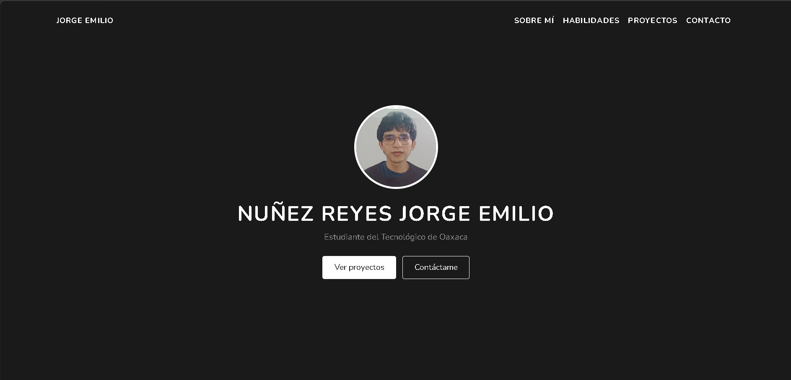
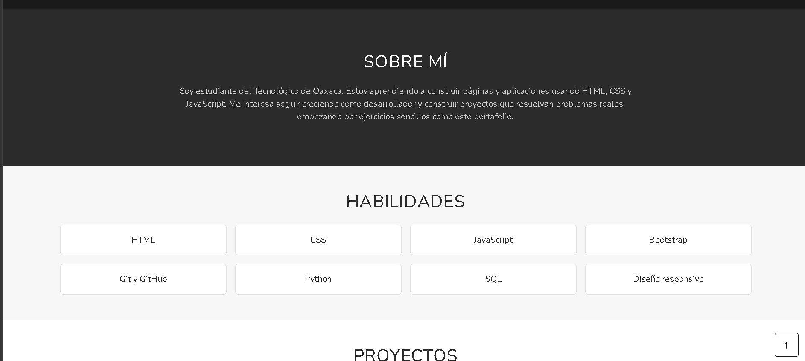
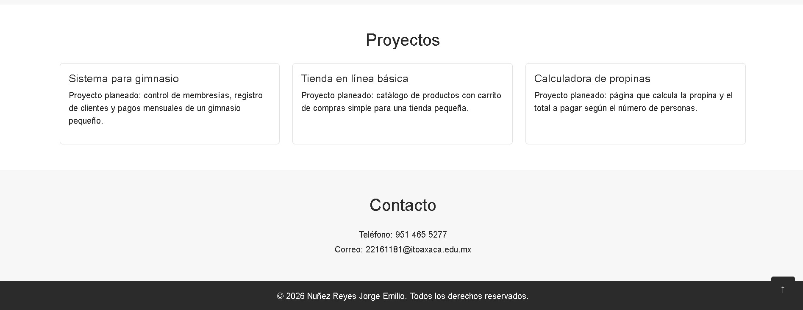

# Portafolio — Nuñez Reyes Jorge Emilio

Portafolio personal de una sola página construido con **Bootstrap 5**, hecho
como ejercicio del curso de Desarrollo Web. Muestra quién me gustaria ser, las 
habilidades y algunos proyectos que tengo planeados.

---

## GitHub Pages

https://emilioreyes2219.github.io/Portafolio/

---

## Descripción del proyecto

- **Framework CSS usado:** Bootstrap 5 (vía CDN, solo para el sistema de
  columnas/rejilla), más un archivo `portafolio.css` con estilos
  personalizados propios (colores, tarjetas y botones hechos con CSS puro).
- **Diseño:** simple, en tonos blanco, gris claro y gris oscuro.

### Secciones del portafolio

- **Inicio:** foto de perfil, mi nombre completo y dos botones para ir a
  proyectos o a contacto.
- **Sobre mí:** breve descripción de quién soy (estudiante del Tecnológico
  de Oaxaca) y qué estoy aprendiendo.
- **Habilidades:** tarjetas con las tecnologías que conozco o estoy
  practicando: HTML, CSS, JavaScript, Bootstrap, Git y GitHub, Python, SQL y
  diseño responsivo.
- **Proyectos:** tarjetas con 3 proyectos planeados: un sistema para
  gimnasio, una tienda en línea básica y una calculadora de propinas.
- **Contacto:** mi número de teléfono y mi correo institucional.

---

## Proceso de creación

1. Elegí Bootstrap 5 como base de estilos y lo agregué por CDN en el
   `<head>` del `index.html`, usando principalmente su sistema de columnas.
2. Partí de la estructura típica de un portafolio de una sola página:
   encabezado de bienvenida y secciones apiladas (Sobre mí, Habilidades,
   Proyectos, Contacto).
3. Adapté el contenido de cada sección a mi información: mi nombre completo,
   que soy estudiante del Tecnológico de Oaxaca, y mis habilidades y las que estoy aprendiendo.
4. En Proyectos usé tarjetas simples con título y descripción para mostrar 3
   ideas de proyectos que quiero desarrollar más adelante, ya que todavía no
   tengo proyectos reales terminados..
5. Añadi una zona de contacto con mi numero telefonico y mi correo institucional y al final una barra de derechos..
   

---

## Capturas de pantalla







---

## Estructura del repositorio

```
/portafolio
 ├── README.md
 ├── index.html
 ├── /css
 │    └── portafolio.css
 ├── /js
 │    └── portafolio.js
 └── /img
      ├── foto-perfil.jpg
      └── (capturas usadas en este README)
```


---


